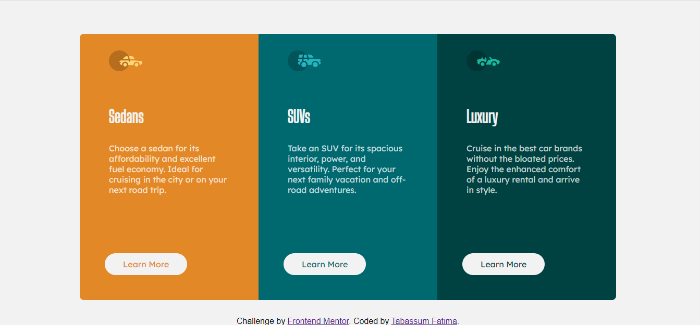

# Frontend Mentor - 3-column preview card component solution

This is a solution to the [3-column preview card component challenge on Frontend Mentor](https://www.frontendmentor.io/challenges/3column-preview-card-component-pH92eAR2-). Frontend Mentor challenges help you improve your coding skills by building realistic projects.
In the design folder is the Design of the website we need to make and style-guide.md has the style of the website we require.

## Table of contents

- [Overview](#overview)
  - [The challenge](#the-challenge)
  - [Screenshot](#screenshot)
  - [Links](#links)
  - [Built with](#built-with)
  - [What I learned](#what-i-learned)
  - [Continued development](#continued-development)
- [Author](#author)

## Overview

### The challenge

Users should be able to:

- View the optimal layout depending on their device's screen size
- See hover states for interactive elements

### Screenshot

### Links

- [Solution URL](https://www.frontendmentor.io/solutions/3-column-preview-card-component-using-html-and-css-pZVtdlOul)
- [Live Site URL](https://tab21.github.io/Frontend-Mentor/3-column-card/index.html)

### Built with

- Semantic HTML5 markup
- CSS custom properties
- Flexbox
- CSS Grid

### What I learned

I learned the css flexbox which i still need to work on.It also made me work on responsive and adding different padding to different widths of the device.

### Continued development

I still need to work on my display and positioning skills.

## Author

- Frontend Mentor - [@tab21](https://www.frontendmentor.io/profile/tab21)
