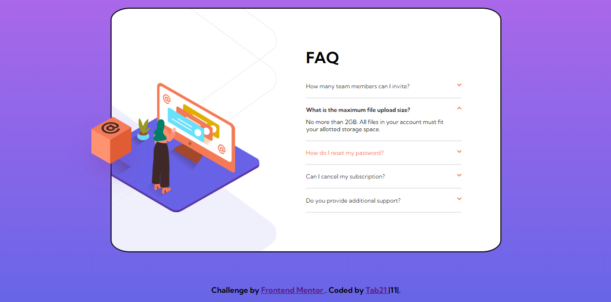
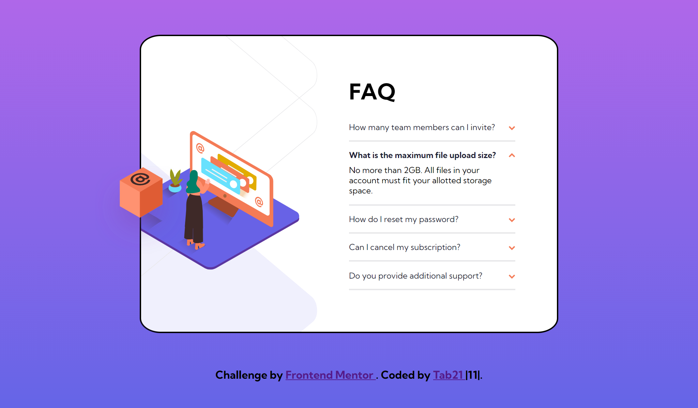
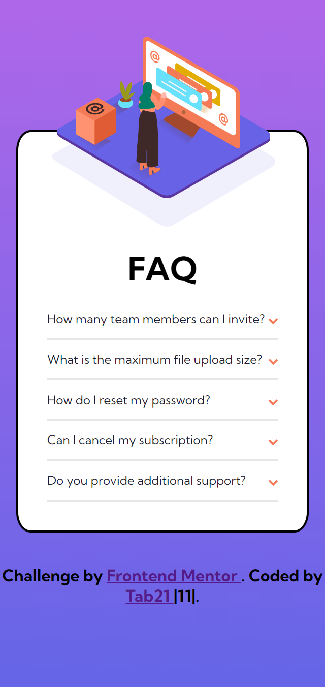

# Frontend Mentor - FAQ accordion card solution

This is a solution to the [FAQ accordion card challenge on Frontend Mentor](https://www.frontendmentor.io/challenges/faq-accordion-card-XlyjD0Oam). Frontend Mentor challenges help you improve your coding skills by building realistic projects.

## Table of contents

- [Overview](#overview)
  - [The challenge](#the-challenge)
  - [Screenshot](#screenshot)
  - [Links](#links)
- [My process](#my-process)
  - [Built with](#built-with)
  - [Continued development](#continued-development)
- [Author](#author)

## Overview

### The challenge

Users should be able to:

- View the optimal layout for the component depending on their device's screen size
- See hover states for all interactive elements on the page
- Hide/Show the answer to a question when the question is clicked

### Screenshot

- Active states screenshot

- Desktop Preview

- Mobile Preview

### Links

- Solution URL: [solution URL here](https://www.frontendmentor.io/solutions/responsive-faq-accordation-using-jvascript-jquery-J33AEszcx)
- Live Site URL: [live site URL here](https://tab21.github.io/Frontend-Mentor/FAQ/index.html)

## My process

### Built with

- Semantic HTML5 markup
- CSS
- Javascript
- Jquery (javascript library)

### Continued development

Positiong elements is something I still sometimes find Difficult specially when making them responsive.

In this I specially found positioning Illustrations which took quite a time and I believe is still not perfect.

Thus, Learning and using some other positioning such us fixed, static, sticky is someting I need to refine.

## Author

- Frontend Mentor - [@tab21](https://www.frontendmentor.io/profile/tab21)
