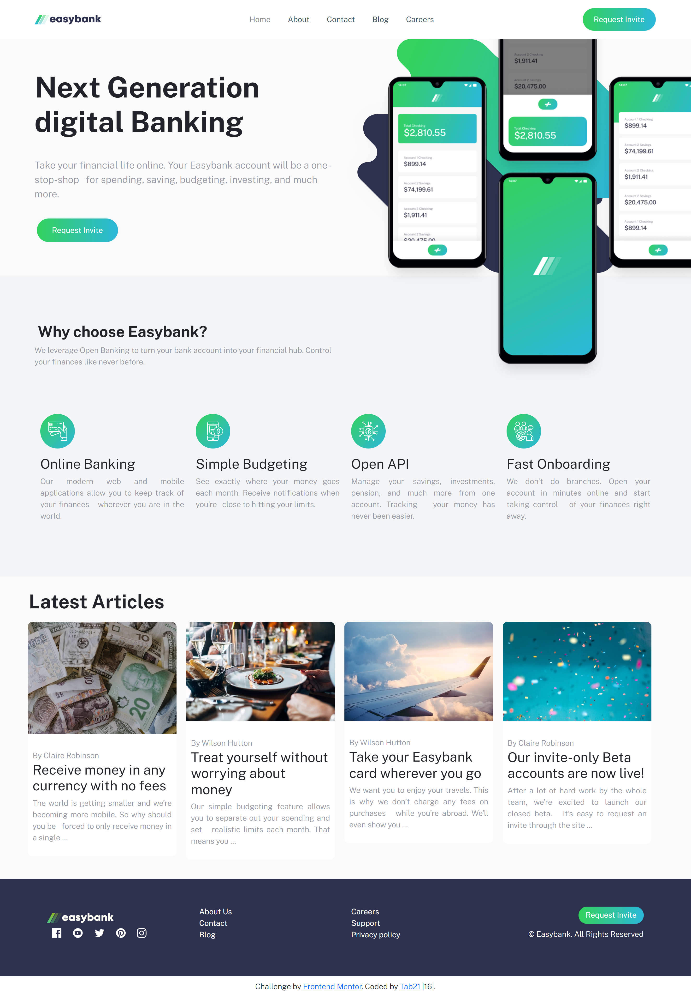

# Global Hack Week

for challenge : Share a project using the GitHub Student Developer Pack.

I made the Frontend Mentor challenge with bootstrap studio.

## Frontend Mentor - Easybank landing page solution

This is a solution to the [Easybank landing page challenge on Frontend Mentor](https://www.frontendmentor.io/challenges/easybank-landing-page-WaUhkoDN). Frontend Mentor challenges help you improve your coding skills by building realistic projects.

## Table of contents

- [Overview](#overview)
  - [The challenge](#the-challenge)
  - [Screenshot](#screenshot)
  - [Links](#links)
- [My process](#my-process)
  - [Built with](#built-with)
  - [What I learned](#what-i-learned)
- [Author](#author)
- [Acknowledgments](#acknowledgments)

## Overview

### The challenge

Users should be able to:

- View the optimal layout for the site depending on their device's screen size
- See hover states for all interactive elements on the page

### Screenshot

### Links

- Solution URL: [Add solution URL here](https://your-solution-url.com)
- Live Site URL: [Add live site URL here](https://your-live-site-url.com)

## My process

### Built with

- Semantic HTML5 markup
- CSS custom properties
- Flexbox
- CSS Grid
- Bootstrap Studio

### What I learned

Doing this project I learnt Bootstrap studio. Also CSS filter property for the icons hover states.

## Author

- Frontend Mentor - [@tab21](https://www.frontendmentor.io/profile/tab21)

## Acknowledgments

I want to thank @pixan198 for teaching us in the GHW event how to use Bootstrap Studio.
