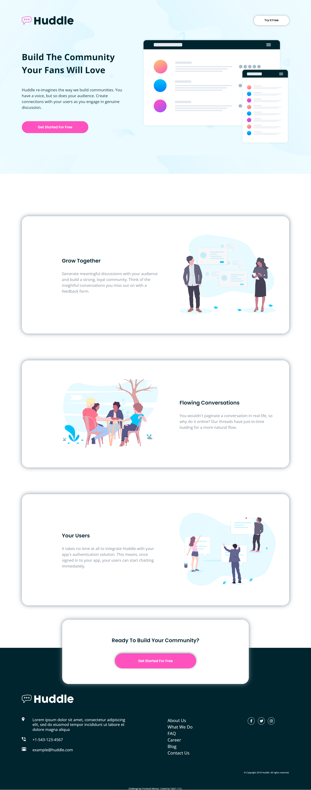
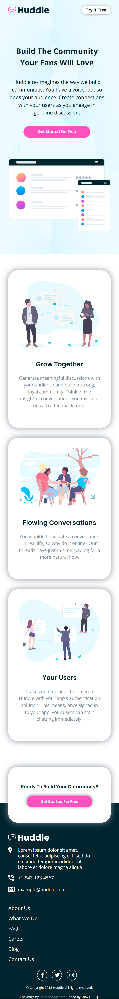

# Frontend Mentor - Huddle landing page with alternating feature blocks solution

This is a solution to the [Huddle landing page with alternating feature blocks challenge on Frontend Mentor](https://www.frontendmentor.io/challenges/huddle-landing-page-with-alternating-feature-blocks-5ca5f5981e82137ec91a5100). Frontend Mentor challenges help you improve your coding skills by building realistic projects.

## Table of contents

- [Overview](#overview)
  - [The challenge](#the-challenge)
  - [Screenshot](#screenshot)
  - [Links](#links)
- [My process](#my-process)
  - [Built with](#built-with)
  - [What I learned](#what-i-learned)
  - [Continued development](#continued-development)
- [Author](#author)

## Overview

### The challenge

Users should be able to:

- View the optimal layout for the site depending on their device's screen size
- See hover states for all interactive elements on the page

### Screenshot

-Desktop Screenshot

-Mobile Screenshot

### Links

- Solution URL: [solution URL here](https://www.frontendmentor.io/solutions/responsive-huddle-landing-page-4qsANumwk)
- Live Site URL: [live site URL here](https://tab21.github.io/Frontend-Mentor/huddleLandingPage/index.html)

## My process

### Built with

- Semantic HTML5 markup
- CSS custom properties
- Flexbox

### What I learned

When doing this challenge I didnt knew filter in CSS. I used it to change the logo color in the footer to white from pink and black which was the original color which is on the top of the website. This was something new for me.When learning how to do it I also used various combinations of it which helped me understand it better.

### Continued development

I still sometimes find positioning such as static,fixed difficult. I took me quite sometime to position the last section as some part of it is on the footer section. I want to refine my positioning skills and do better in the future projects.

## Author

- Frontend Mentor - [@tab21](https://www.frontendmentor.io/profile/tab21)
