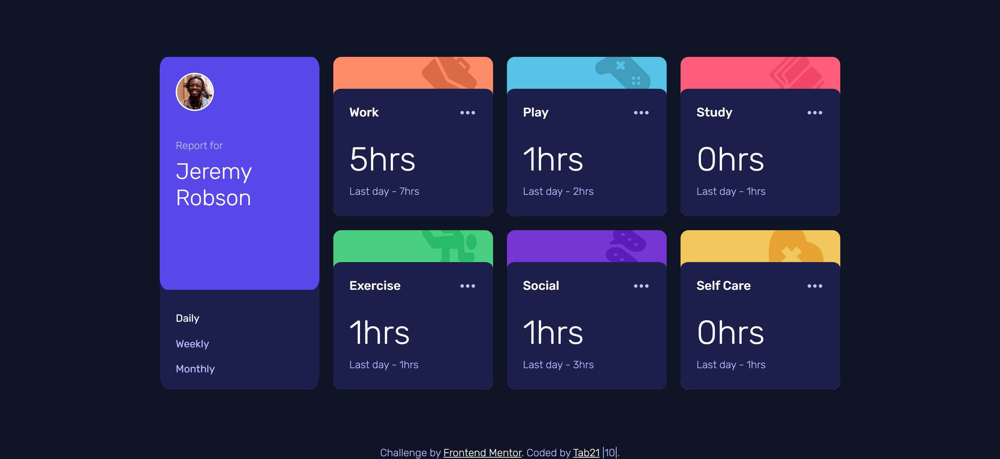
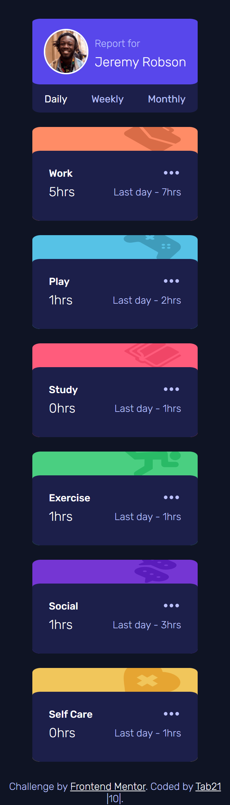

# Frontend Mentor - Time tracking dashboard solution

This is a solution to the [Time tracking dashboard challenge on Frontend Mentor](https://www.frontendmentor.io/challenges/time-tracking-dashboard-UIQ7167Jw). Frontend Mentor challenges help you improve your coding skills by building realistic projects.

## Table of contents

- [Overview](#overview)
  - [The challenge](#the-challenge)
  - [Screenshot](#screenshot)
  - [Links](#links)
- [My process](#my-process)
  - [Built with](#built-with)
  - [What I learned](#what-i-learned)
- [Author](#author)

## Overview

### The challenge

Users should be able to:

- View the optimal layout for the site depending on their device's screen size
- See hover states for all interactive elements on the page
- Switch between viewing Daily, Weekly, and Monthly stats

### Screenshot

- Desktop Screenshot



- Mobile Screenshot



### Links

- Solution URL: [Add solution URL here](https://your-solution-url.com)
- Live Site URL: [Add live site URL here](https://your-live-site-url.com)

## My process

### Built with

- Semantic HTML5 markup
- CSS custom properties
- CSS Flex
- CSS Grid
- Javascript - Jquery

### What I learned

Through this challenge I learned handling JSON data through javascript. First how to fetch JSON data and then using the data in the website through javascript.

JS code I am proud of right now :smiley: :

```js
var data = [];

fetch('data.json').then(result => result.json()).then((result) => {
    data = result;
    // some more code according to the usage of the data I passed this data into function.
};
```

## Author

- Frontend Mentor - [@tab21](https://www.frontendmentor.io/profile/tab21)
